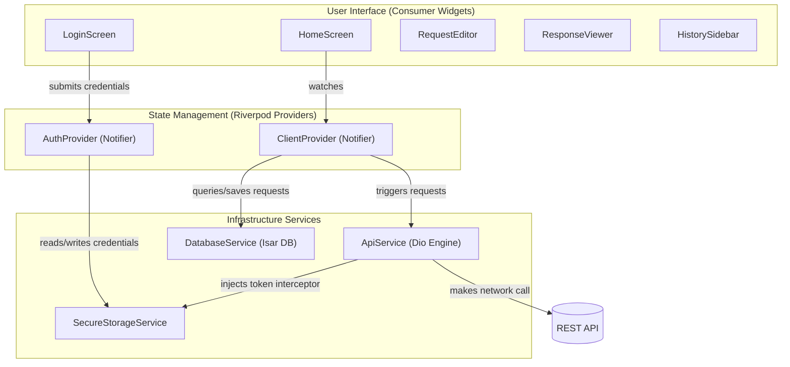

# Antigravity API Client

[](https://github.com/sahilyadav-01/Open-Source-API-Client/actions)
[](https://opensource.org/licenses/MIT)
[](https://flutter.dev)

A production-grade, enterprise-ready reference API Client built in Flutter. This workspace implements secure native key management, type-safe compile-time state generation, automatic offline caching databases, and declarative routing with authentication guards.

---

## 🏛️ Architecture Overview

The workspace follows a clean, reactive architecture with unidirectional data flow. UI screens consume state generated by Riverpod providers, which manage local Isar DB transactions and network calls through Dio.



---

## ✨ Key Features

- **🔑 Secure Credentials Vault:** Wraps native credentials using `flutter_secure_storage`. Android payloads are encrypted via AES inside Android Keystore wrappers, and iOS tokens are stored in the Keychain using security bindings.
- **🗄️ Offline DB Caching:** Incorporates `isar_community` local NoSQL database to persist history log records. Queries, modifications, and deletions are handled through ACID-compliant transactions.
- **🛣️ Declarative Routing:** Configured with `go_router` supporting deep-linking. An automated routing guard watches authentication status from Riverpod and redirects unauthenticated users to `/login`.
- **📦 Code-Generated State Safety:** State containers are powered by `flutter_riverpod` with compile-time code-generators (`riverpod_generator`), ensuring type safety and structural reliability.
- **🌐 Network Engine Interceptor:** Engineered with `dio` REST client. Includes an automated request interceptor that dynamically reads the active authorization key from secure storage and injects it as a `Bearer` header.
- **⚡ Parallel Builders:** Customized `build.yaml` file to partition compiler builders, avoiding dependency cycles and maximizing build_runner compilation speed.

---

## 📁 Directory Structure

```text
lib/
├── models/         # Freezed data models & database schemas
├── providers/      # Riverpod business logic & notifiers
├── routing/        # GoRouter navigation paths & guards
├── screens/        # Screen UI components (Login, Dashboard)
├── services/       # Dio network, Isar database, Secure storage
└── widgets/        # Modular dashboard panels (Editor, Viewer)
```

---

## 🚀 Quickstart Setup

### Prerequisites

Ensure you have the Flutter SDK (v3.10+) and Android SDK setup correctly.

### 1. Clone the repository
```bash
git clone https://github.com/sahilyadav-01/Open-Source-API-Client.git
cd Open-Source-API-Client
```

### 2. Install dependencies
```bash
flutter pub get
```

### 3. Run code generators
Generate the model parsing, Isar schemas, and Riverpod providers:
```bash
flutter pub run build_runner build --delete-conflicting-outputs
```

### 4. Run the application
Run on the connected emulator or desktop environment:
```bash
flutter run
```

---

## 🧪 Testing & Code Quality

### Run Unit Tests
To execute model serialization and caching tests:
```bash
flutter test
```

### Run Static Analysis
To ensure standard compliance and clean code formatting:
```bash
flutter analyze
```

---

## 🤖 CI/CD Workflow

A GitHub Actions verification workflow is configured at [.github/workflows/verify.yml](file:///.github/workflows/verify.yml). It triggers on every push/pull request to main and runs:
- Setup Flutter SDK environment
- Fetch dependencies
- Code compile generation via `build_runner`
- Check linter static analysis
- Run all unit tests with test coverage reporting
